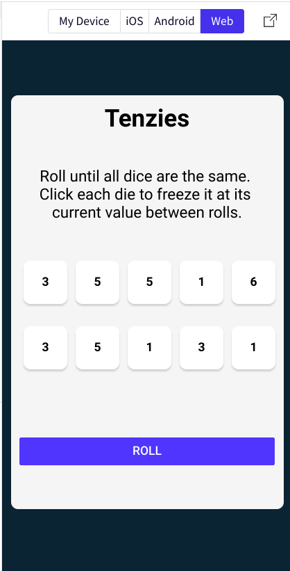
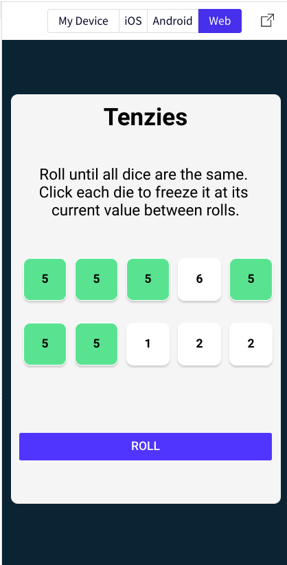
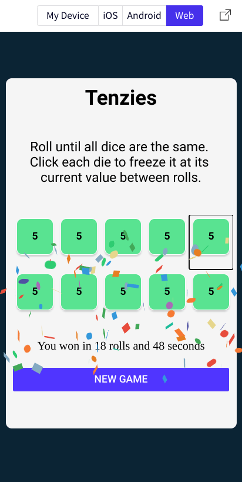
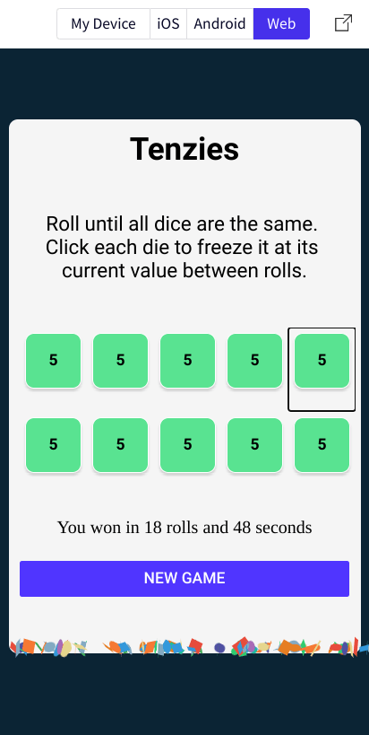

# React Native Tenzies

This is a react native conversion of my [tenzies app](https://github.com/jdegand/tenzies). Used a different implementation of React Confetti and had to replace nanoid with react-native-random-uuid.  This was a quick fix and better packages for random id generation exist.  The React Confetti cannon package can have some performance issues so I limited the confetti to 100 pieces versus the 200 standard.  From the original app, I changed the placement of the won message to above the roll button and changed the styling to prevent the layout shift caused from the win message being conditionally rendered. 

## Screenshots

***

***

***

***

## Useful Resources

- [Stack Overflow](https://stackoverflow.com/questions/67682503/how-to-generate-unique-id-in-react-native) - generate unique id in react native
- [Stack Overflow](https://stackoverflow.com/questions/45939823/react-native-horizontal-flatlist-with-multiple-rows) - react native horizontal flatlist with multiple rows
- [Stack Overflow](https://stackoverflow.com/questions/44608824/click-listener-in-flatlist) - Pressable recommended 
- [Stack Overflow](https://stackoverflow.com/questions/45478621/react-native-styling-with-conditional) - react native styling with conditional
- [Github](https://github.com/VincentCATILLON/react-native-confetti-cannon) - react native confetti cannon
- [Stack Overflow](https://stackoverflow.com/questions/49945024/react-native-flatlist-2-items-per-row-width-not-equal) - react native flatlist 2 items per row
- [Stack Overflow](https://stackoverflow.com/questions/41754471/change-button-color-react-native) - change button color react native
- [ReactNativeExpress](https://www.reactnative.express/react/conditional_rendering) - conditional rendering
- [Stack Overflow](https://stackoverflow.com/questions/42959318/react-native-how-to-use-a-boolean) - react native how to use a boolean
- [Stack Overflow](https://stackoverflow.com/questions/44608824/click-listener-in-flatlist) - click listener in flatlist
- [YouTube](https://www.youtube.com/watch?v=UBP0MfHCgo4) - How to use Custom Fonts in React Native Expo
- [Github](https://github.com/expo/expo/blob/main/packages/%40expo/config-types/src/ExpoConfig.ts) - Expo Config properties
